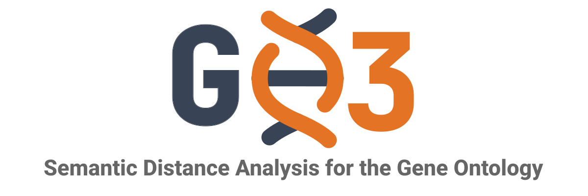
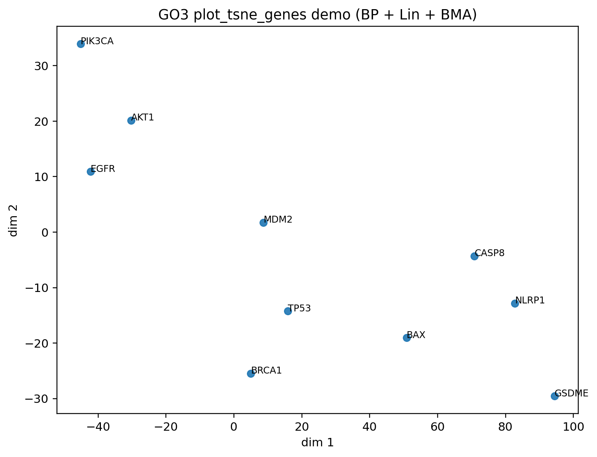
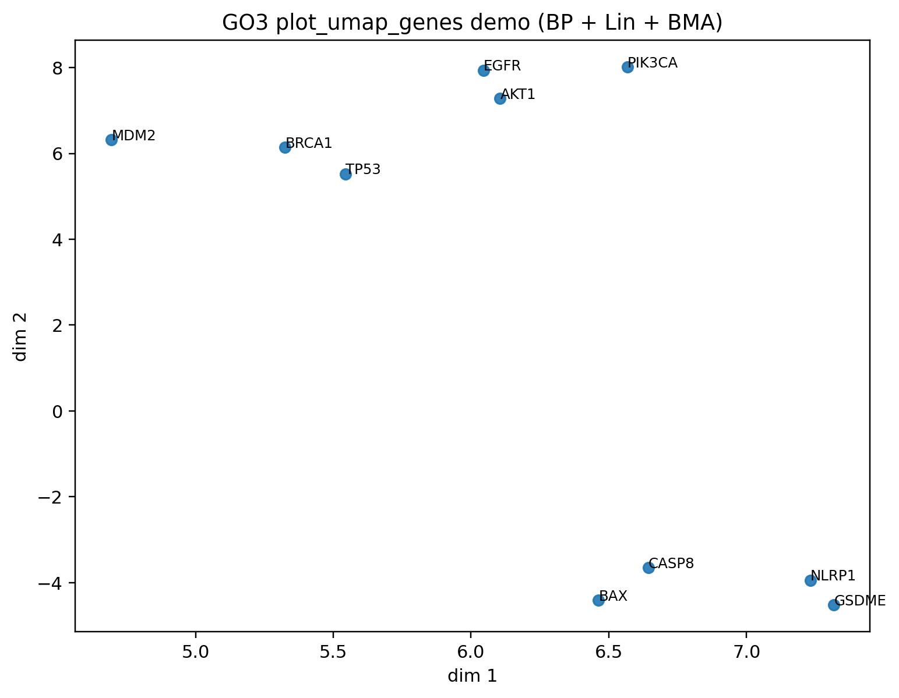

# GO3: Gene Ontology Semantic Similarity (Rust + Python)



[](https://pypi.org/project/GO3/)
[](https://go3.readthedocs.io/en/latest/)
[](LICENSE)

## Table of Contents

- [Introduction](#introduction)
- [Features](#features)
- [Installation](#installation)
- [Input Data](#input-data)
- [Quick Start](#quick-start)
- [Similarity Methods](#similarity-methods)
- [API Overview](#api-overview)
- [How It Works](#how-it-works)
- [Common Workflows](#common-workflows)
- [Performance and Benchmarks](#performance-and-benchmarks)
- [Documentation](#documentation)
- [Contributing](#contributing)
- [Citation](#citation)
- [License](#license)

## Introduction

Gene Ontology (GO) semantic similarity measures how functionally related two GO terms or gene products are, based on their positions and relationships within the GO hierarchy. It is widely used in bioinformatics for gene clustering, functional module detection, disease-gene prioritization, and protein–protein interaction prediction.

GO3 is a high-performance GO semantic similarity library built on a **Rust core** exposed through a **Python API** (via PyO3). It provides 8 term-level similarity methods, 5 groupwise strategies, and parallelized batch operations, all accessible from a simple Python interface.

### Why GO3?

Existing tools like [GOATOOLS](https://github.com/tanghaibao/goatools) (Python), [FastSemSim](https://pypi.org/project/fastsemsim/) (Python), [GOSemSim](https://bioconductor.org/packages/GOSemSim/) (R), [simona](https://bioconductor.org/packages/simona/) (R), and [TaxaGO](https://github.com/TaxaGO/TaxaGO) (Rust CLI) cover term-level semantic similarity, but many common operations in GO-based analyses — comparing sets of terms, computing gene-level similarity, building distance matrices, or generating embeddings — require writing ad-hoc glue code or switching between languages and packages. GO3 brings all of these into a single Python library:

- **Term-level similarity** — 8 methods (IC-based, topological, and hybrid) in one place.
- **Term-set and gene-level similarity** — compare two sets of GO terms or two genes directly, with 5 groupwise strategies.
- **Batch operations** — compute thousands of term or gene pairs in a single call, parallelized automatically.
- **All-vs-all distance matrices** — one function call for a full symmetric distance matrix over any gene list.
- **Embeddings and visualization** — built-in t-SNE, UMAP, and plotting helpers, no external pipeline needed.
- **Speed** — the fastest library in our benchmark: 3.6–12.5× faster initialization and 2–25× faster gene-level similarity than other Python/R libraries.
- **Minimal setup** — load an OBO file (auto-downloadable) and a GAF file, and you're ready to compute.

Preprint:
https://www.biorxiv.org/content/10.1101/2025.09.04.669468v1

## Features

- **8 term-level similarity methods** — Resnik, Lin, Jiang-Conrath, SimRel, ICCoef, GraphIC, Wang, TopoICSim
- **5 groupwise strategies** — BMA, MAX, AVG, Hausdorff, SimGIC
- **Gene-level comparison** with namespace filtering (BP / MF / CC)
- **Batch and all-vs-all operations** parallelized with Rayon
- **Distance matrices** from any similarity/groupwise combination
- **t-SNE and UMAP embeddings** built on top of distance matrices
- **Visualization helpers** (`plot_tsne_genes`, `plot_umap_genes`, `plot_embedding`)
- **Thread control** via `set_num_threads`
- **Auto-download** of the GO OBO file when no path is provided

## Installation

```bash
pip install go3
```

Pre-built wheels are available for common platforms. Requires **Python >= 3.7**.

For visualization support (matplotlib, scikit-learn, umap-learn):

```bash
pip install go3[viz]
```

The `[viz]` extras enable `plot_tsne_genes`, `plot_umap_genes`, `plot_embedding`, and the `tsne_genes` / `umap_genes` embedding functions.

## Input Data

GO3 requires two input files:

### OBO file (Gene Ontology structure)

The OBO file defines the ontology: terms, their names, namespaces, and hierarchical relationships (is_a, part_of).

- **Auto-download**: call `go3.load_go_terms()` with no arguments to download the latest `go-basic.obo` automatically.
- **Manual download**: get it from the [Gene Ontology downloads page](http://purl.obolibrary.org/obo/go/go-basic.obo).

### GAF file (Gene annotations)

A Gene Annotation Format (GAF) file maps gene products to GO terms with evidence codes. GO3 filters obsolete terms automatically (replacing them via `replaced_by` / `consider` fields).

- **Download from UniProt-GOA**: annotation files for many organisms are available at [https://ftp.ebi.ac.uk/pub/databases/GO/goa/](https://ftp.ebi.ac.uk/pub/databases/GO/goa/) (e.g., `goa_human.gaf.gz` for human).

## Quick Start

```python
import go3

# 1) Load the GO ontology (pass no argument to auto-download go-basic.obo)
go3.load_go_terms("go-basic.obo")

# 2) Load gene annotations from a GAF file
annots = go3.load_gaf("goa_human.gaf")

# 3) Build a term counter: computes annotation counts and Information Content (IC)
counter = go3.build_term_counter(annots)

# 4) Term similarity — compare two GO terms using the Lin method
sim = go3.semantic_similarity("GO:0008150", "GO:0009987", "lin", counter)
print(f"Term similarity: {sim:.4f}")

# 5) Gene similarity — compare two genes on Biological Process using Lin + BMA
score = go3.compare_genes("TP53", "BRCA1", "BP", "lin", "bma", counter)
print(f"Gene similarity: {score:.4f}")
```

## Similarity Methods

### Term-level methods

| Method | Key | Description |
|---|---|---|
| Resnik | `resnik` | Information Content (IC) of the Most Informative Common Ancestor (MICA) |
| Lin | `lin` | Normalized Resnik: `2 * IC(MICA) / (IC(t1) + IC(t2))` |
| Jiang-Conrath | `jc` | IC-based distance converted to similarity |
| SimRel | `simrel` | Lin with a relevance correction factor |
| ICCoef | `iccoef` | IC ratio relative to the minimum IC of the two terms |
| GraphIC | `graphic` | IC normalized by graph depth |
| Wang | `wang` | Topological method using weighted ancestor paths (no IC needed) |
| TopoICSim | `topoicsim` | Hybrid topology + IC method using disjunctive common ancestors |

### Groupwise strategies (for term sets and genes)

| Strategy | Key | Description |
|---|---|---|
| Best Match Average | `bma` | Average of best-match similarities in both directions |
| Maximum | `max` | Maximum pairwise similarity across all pairs |
| Average | `avg` | Mean of all pairwise similarities |
| Hausdorff | `hausdorff` | Minimax-based similarity (worst best-match) |
| SimGIC | `simgic` | IC-weighted Jaccard index over ancestor sets |

## API Overview

### Loading and Initialization

| Function | Description |
|---|---|
| `load_go_terms(path=None)` | Load GO terms from an OBO file; auto-downloads if no path given |
| `load_gaf(path)` | Load gene annotations from a GAF file |
| `build_term_counter(annotations)` | Compute annotation counts and IC values for all terms |

### Ontology Traversal

| Function | Description |
|---|---|
| `get_term_by_id(go_id)` | Retrieve a GO term object by its ID |
| `ancestors(go_id)` | Get all ancestor term IDs (via is_a relationships) |
| `common_ancestor(go_id1, go_id2)` | Get all common ancestors of two terms |
| `deepest_common_ancestor(go_id1, go_id2)` | Get the most specific (deepest) common ancestor |

### Term Similarity

| Function | Description |
|---|---|
| `semantic_similarity(id1, id2, method, counter)` | Pairwise similarity between two GO terms |
| `batch_similarity(list1, list2, method, counter)` | Parallel pairwise similarity for lists of term pairs |
| `term_ic(go_id, counter)` | Information Content of a single GO term |

### Set Similarity

| Function | Description |
|---|---|
| `termset_similarity(terms1, terms2, method, groupwise, counter)` | Similarity between two sets of GO terms |

### Gene Similarity

| Function | Description |
|---|---|
| `compare_genes(gene1, gene2, ontology, similarity, groupwise, counter)` | Similarity between two genes |
| `compare_gene_pairs_batch(pairs, ontology, similarity, groupwise, counter)` | Parallel similarity for a list of gene pairs |

### Distance and Embeddings

| Function | Description |
|---|---|
| `gene_distance_matrix(genes, ontology, similarity, groupwise, counter, distance_transform)` | All-vs-all distance matrix for a set of genes |
| `tsne_genes(genes, ontology, similarity, groupwise, counter, ...)` | t-SNE embedding from a gene distance matrix |
| `umap_genes(genes, ontology, similarity, groupwise, counter, ...)` | UMAP embedding from a gene distance matrix |

### Visualization

| Function | Description |
|---|---|
| `plot_embedding(embedding, genes, ...)` | Plot a 2D embedding with matplotlib |
| `plot_tsne_genes(genes, ontology, similarity, groupwise, counter, ...)` | Compute t-SNE and plot in one step |
| `plot_umap_genes(genes, ontology, similarity, groupwise, counter, ...)` | Compute UMAP and plot in one step |

### Configuration

| Function | Description |
|---|---|
| `set_num_threads(n)` | Set the number of threads for parallel operations (0 = all cores) |

## How It Works

GO3's Rust core is compiled into a Python extension module via [PyO3](https://pyo3.rs/) and [Maturin](https://www.maturin.rs/). The ontology graph, gene-to-GO mappings, ancestor sets, and IC values are stored in global caches (using fast hash maps from `rustc-hash`) so they are computed once and reused across all subsequent calls.

Batch operations (`batch_similarity`, `compare_gene_pairs_batch`, `gene_distance_matrix`) are parallelized with [Rayon](https://github.com/rayon-rs/rayon), which distributes work across threads automatically. Unique pairs are deduplicated before computation to avoid redundant work.

This architecture — native compiled code, global caching, and data-parallel execution — is what gives GO3 its order-of-magnitude speedups over Python and R libraries on medium and large workloads.

## Common Workflows

### Batch term similarity

```python
pairs = [("GO:0006397", "GO:0008380"), ("GO:0008150", "GO:0009987")]
scores = go3.batch_similarity([a for a, _ in pairs], [b for _, b in pairs], "lin", counter)
```

### Batch gene similarity

```python
gene_pairs = [("TP53", "BRCA1"), ("EGFR", "AKT1")]
scores = go3.compare_gene_pairs_batch(gene_pairs, "BP", "lin", "bma", counter)
```

### Term-set similarity

```python
# Compare two sets of GO terms directly (without gene lookup)
set_a = ["GO:0006397", "GO:0008380", "GO:0000398"]
set_b = ["GO:0006396", "GO:0010467"]
sim = go3.termset_similarity(set_a, set_b, "lin", "bma", counter)
print(f"Term-set similarity: {sim:.4f}")
```

### Ontology traversal

```python
# Inspect a GO term
term = go3.get_term_by_id("GO:0006397")
print(term.name)        # "mRNA processing"
print(term.namespace)   # "biological_process"
print(term.parents)     # parent term IDs

# Get ancestors and common ancestors
anc = go3.ancestors("GO:0006397")
dca = go3.deepest_common_ancestor("GO:0006397", "GO:0008380")
print(f"Deepest common ancestor: {dca}")
```

### Thread configuration

```python
# Use 4 threads for parallel operations
go3.set_num_threads(4)

# Use all available cores
go3.set_num_threads(0)
```

### Distance matrix + embedding

```python
genes = ["TP53", "BRCA1", "EGFR", "AKT1", "CASP8"]

ordered, dist = go3.gene_distance_matrix(
    genes,
    ontology="BP",
    similarity="lin",
    groupwise="bma",
    counter=counter,
    distance_transform="auto",
)

ordered, emb_tsne = go3.tsne_genes(
    genes, "BP", "lin", "bma", counter, perplexity=2.0, random_state=42
)

ordered, emb_umap = go3.umap_genes(
    genes, "BP", "lin", "bma", counter, n_neighbors=3, random_state=42
)
```

### Plot helpers

```python
ordered, emb_t, fig_t, ax_t = go3.plot_tsne_genes(
    genes, "BP", "lin", "bma", counter, perplexity=2.0, random_state=42, annotate="auto"
)

ordered, emb_u, fig_u, ax_u = go3.plot_umap_genes(
    genes, "BP", "lin", "bma", counter, n_neighbors=3, random_state=42, annotate="auto"
)
```

Example outputs:





## Performance and Benchmarks

GO3 was benchmarked against five established libraries — **GOATOOLS** (Python), **FastSemSim** (Python), **GOSemSim** (R), **simona** (R), and **TaxaGO** (Rust CLI) — on the human GO annotation corpus (Biological Process, Lin similarity, BMA groupwise). Hardware: Apple M3 Pro, 18 GB RAM, macOS.

GO3 is the fastest library in every workload measured:

| Workload | Fastest alternative | GO3 speedup range |
|---|---|---|
| Loading + IC computation | FastSemSim (5.44 s) | 3.6–12.5× over Python/R libraries |
| Batch term similarity (5,050 pairs) | FastSemSim (10.4 ms) | 4× over FastSemSim; 24× over GOATOOLS; >6,000× over simona; ~4×10⁵ over GOSemSim |
| Batch gene similarity (100 pairs, BMA) | FastSemSim (2.39 s) | 2× over FastSemSim; 5× over simona; 13× over GOATOOLS; 25× over GOSemSim; 25–119× over TaxaGO |

Numerical validation across all libraries is provided in [`imgs/validation/Supplementary Material S1.pdf`](imgs/validation/Supplementary%20Material%20S1.pdf) (generated by [`scripts/validate_cross_tool.py`](scripts/validate_cross_tool.py)): GO3 and GOATOOLS agree near-perfectly (Pearson *r* > 0.97 at both term and gene level); the remaining libraries diverge moderately due to differences in ancestor traversal and MICA selection, which is expected behavior of each tool's published algorithm. TaxaGO is invoked with `--propagate-counts` to ensure IC computation is consistent with all other libraries.

### Loading and memory


TaxaGO is excluded from the loading comparison because, as a standalone binary, its initialization semantics are not directly comparable to embeddable libraries.

### Batch GO-term similarity


### Batch gene similarity


For full methodology, reproducibility scripts, and raw data, see the [benchmark documentation](https://go3.readthedocs.io/en/latest/benchmarks.html).

## End-to-end example notebook

An end-to-end walkthrough is provided in [`scripts/Supplementary Notebook S2.ipynb`](scripts/Supplementary%20Notebook%20S2.ipynb), which applies GO3 to the Genomics England *Parkinson Disease and Complex Parkinsonism* gene panel to:

1. Quantify GO annotation redundancy via all-vs-all term similarity.
2. Cluster semantically overlapping BP terms and select the most informative representative per cluster (~48% reduction in term count).
3. Compute a gene-by-gene BMA similarity matrix for the panel.
4. Visualize the functional landscape with t-SNE.

The notebook recovers known biology (PINK1/PRKN/PARK7 (mitophagy), GCH1/TH/SPR (dopamine biosynthesis), SLC30A10/SLC39A14/FTL (metal ion transport) ) illustrating how GO3 can condense a large, redundant enrichment output into an interpretable functional summary.

## Documentation

Full docs:

- https://go3.readthedocs.io

## Contributing

Contributions are welcome! To set up a development environment:

```bash
# Clone the repository
git clone https://github.com/Mellandd/go3.git
cd go3

# Create a virtual environment and install dev dependencies
python -m venv .venv
source .venv/bin/activate
pip install maturin pytest

# Build the Rust extension in development mode
maturin develop

# Run the tests
pytest tests/
```

Please open an issue or pull request on [GitHub](https://github.com/Mellandd/go3).

## Citation

```text
go3: A Fast and Lightweight Library for Semantic Similarity of GO Terms and Genes
Jose L. Mellina-Andreu, Alejandro Cisterna-Garcia, Juan A. Botia
bioRxiv 2025.09.04.669468; doi: https://doi.org/10.1101/2025.09.04.669468
```

BibTeX:

```bibtex
@article {go3,
  author = {Mellina-Andreu, Jose L. and Cisterna-Garcia, Alejandro and Botia, Juan A.},
  title = {go3: A Fast and Lightweight Library for Semantic Similarity of GO Terms and Genes},
  elocation-id = {2025.09.04.669468},
  year = {2025},
  doi = {10.1101/2025.09.04.669468},
  publisher = {Cold Spring Harbor Laboratory},
  URL = {https://www.biorxiv.org/content/early/2025/09/04/2025.09.04.669468},
  eprint = {https://www.biorxiv.org/content/early/2025/09/04/2025.09.04.669468.full.pdf},
  journal = {bioRxiv}
}
```

## License

MIT License (see `LICENSE`).
