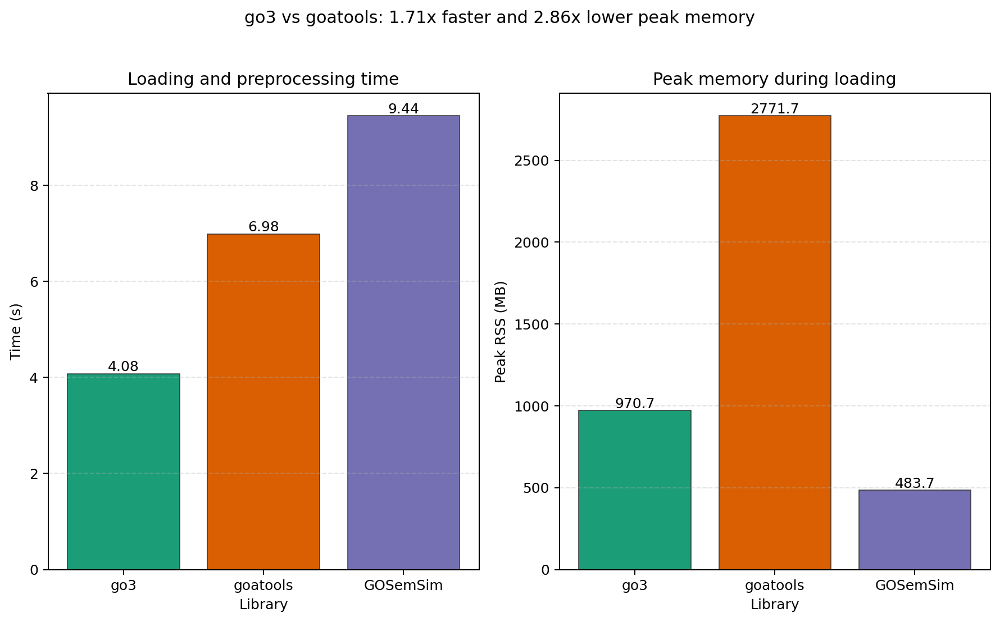
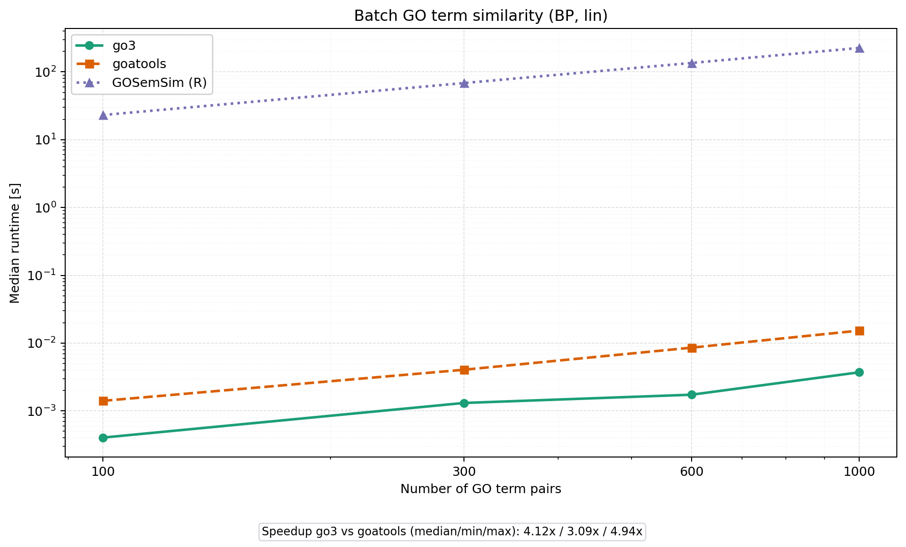
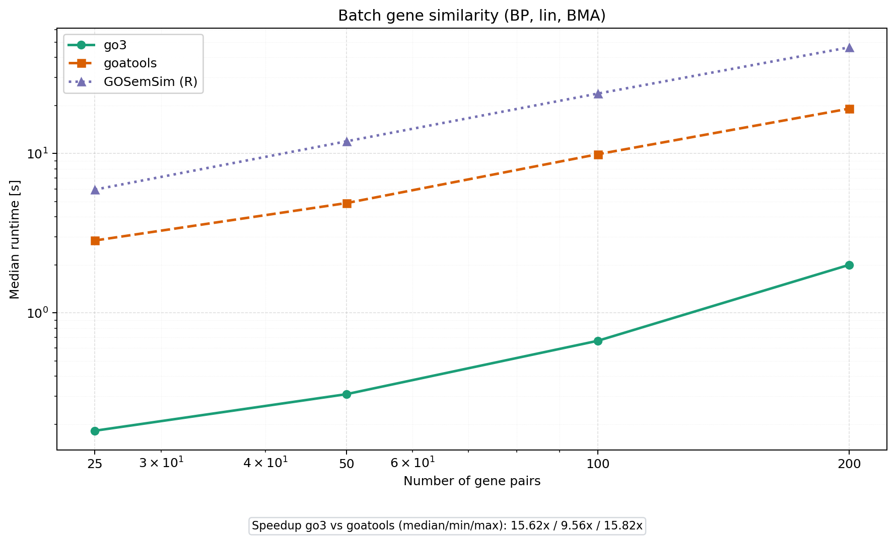
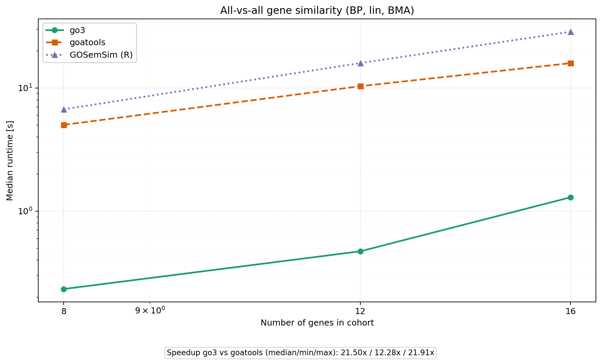

# Benchmarks

GO3 was benchmarked against [goatools](https://github.com/tanghaibao/goatools) (Python) and [GOSemSim](https://bioconductor.org/packages/GOSemSim/) (R/Bioconductor) on realistic workloads using the human GO annotation corpus (Biological Process, Lin similarity, BMA groupwise).

## Summary

| Workload | GO3 vs goatools | GO3 vs GOSemSim |
|---|---|---|
| Loading + IC computation | ~1.6x faster, ~2.9x less memory | — |
| Batch term similarity (up to 20k pairs) | ~8.5x faster | comparable |
| Batch gene similarity (up to 150 pairs) | ~24x faster | ~3x faster |
| All-vs-all genes (up to 16 genes) | ~22x faster | ~3x faster |

The speedup grows with workload size. Exact numbers depend on hardware and dataset versions; see the plots below for detailed scaling behavior.

## Loading and memory



## Batch GO-term similarity



## Batch gene similarity



## All-vs-all gene similarity



## Reading the plots

- Each panel shows absolute runtime curves (log-scale where appropriate).
- A speedup summary text box is included inside the plot.
- Speedup > 1.0 means GO3 is faster.
- For very small inputs, Python overhead can dominate and reduce visible speedup. The practical advantage appears in medium and large workloads.

## Methodology

### Compared libraries

- **GO3**: this package (Rust core, Python API).
- **goatools**: Python-only baseline in the same runtime ecosystem.
- **GOSemSim** (optional): R/Bioconductor reference. Included where available, but differences in ontology/annotation handling limit strict apples-to-apples comparison.

### Loading benchmark

Measured in isolated subprocesses per library to avoid cache carry-over:

1. Load ontology.
2. Load annotations.
3. Build term statistics / IC structures.

Reported metrics: total wall-clock time and peak resident memory (RSS).

### Pair benchmarks (terms and genes)

For each input size *n*:

- The same sampled pair set is used by all libraries.
- Warmup runs are excluded from timing.
- Median over repeated timed runs is reported.
- Throughput (pairs/second) and speedup (goatools_time / go3_time) are computed.

### All-vs-all gene benchmark

For each cohort size *g*:

- All unique gene pairs are generated: *g*(g-1)/2*.
- `go3.compare_gene_pairs_batch` is compared against a goatools-based BMA implementation.
- Median time, throughput, and speedup are reported.

This workload reflects realistic quadratic scenarios often seen in clustering, network construction, or cohort-level exploratory analyses.

### Fairness notes

- All compared methods use the same ontology and GAF inputs.
- Gene-level goatools comparisons rely on an explicit BMA implementation, because goatools does not provide equivalent high-level gene batch APIs.
- Candidate selection favors biologically informative terms and genes (non-trivial IC/depth, sufficiently annotated), which better reflects real downstream analyses.

## Reproducing the benchmarks

The benchmark script is at `scripts/benchmark_go3vsgoatools.py`. Run from an environment where `go3` and `goatools` are installed:

```bash
python scripts/benchmark_go3vsgoatools.py \
  --namespace BP \
  --term-method lin \
  --gene-method lin \
  --term-pair-sizes 1000,5000,20000 \
  --gene-pair-sizes 25,50,100 \
  --matrix-gene-sizes 8,12 \
  --warmup 1 \
  --repeats 2 \
  --threads 8 \
  --outdir imgs
```

To include GOSemSim (requires R with GOSemSim installed):

```bash
python scripts/benchmark_go3vsgoatools.py \
  --include-gosemsim \
  --gosemsim-measure wang \
  --r-libs-user ./.r_libs \
  --outdir imgs
```

### Output artifacts

The script writes:

- `imgs/benchmark_loading_time_memory.png`
- `imgs/benchmark_batch_similarity.png`
- `imgs/benchmark_gene_batch_similarity.png`
- `imgs/benchmark_all_vs_all_gene_similarity.png`
- `imgs/benchmark_results.json` — raw runs, medians, throughput, and speedup summaries.
